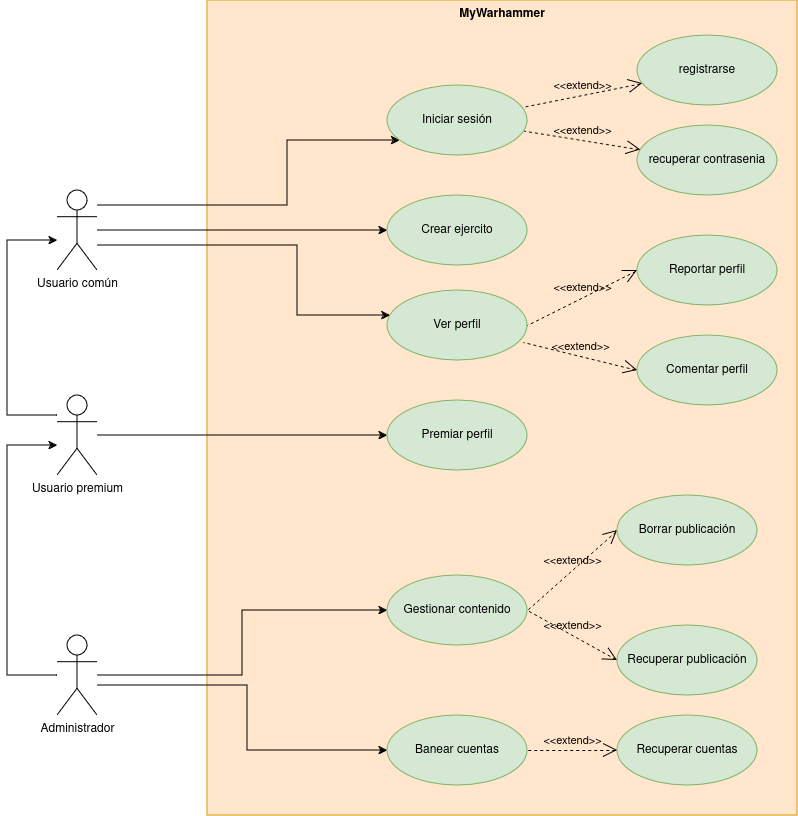

# Especificación de casos de uso

## Especificación de Actores y Operaciones

### Actores

1. **Usuario común**: Usuario con una cuenta en la aplicacion, tiene unos pequeños limitadores y anuncios.
2. **Usuario premium**: Usuario con una cuenta que paga una suscripción y puede usar la aplicación sin limites y sin anuncions.
3. **Administrador**: Un usuario que encargado de moderar que la aplicación no se use de forma indevida y que la comunidad se trate con respeto.

### Casos de uso

#### Usuario común

* **Crear ejercito**: El usuario crea un ejercito unidad a unidad.
* **Reportar perfil**: Avisa a los administradores de que una publicación no podria ser adecuada.
* **Crear Ejercitos**: Crea ejercitos del juego con las miniaturas disponibles.
  
#### Usuario premium

* **Premiar ejercitos**: Da premios simbolicos especiales a las ejercitos de otros usuarios.

#### Administrador

* **Gestionar contenido**: Puede borrar o recuperar publicaciones.
* **Banear cuentas**: Borra o bloqua una cuenta que ya haya subido muchas publicaciones que sean hirientes sensibles o por haber tenido un mal comportamiento de forma continuada.

## Actores

#### Usuario común

|  Actor | Usuario Común |
|---|---|
| Descripción  | _Usuario normal de la aplicación_  |
| Características  |_Usa la aplicación de forma gratuita_ |
| Relaciones | __  |
| Referencias | _Crear ejercito, ver perfiles, iniciar sesion, registrarse, recuperar contrasenia_ |
|  Notas |  __ |
| Autor  | _Alejandro Salazar González_ |
|Fecha | _20/03/2025_ |

|  Atributo |||
|---|---|---|
| _Nombre_  | _Descripción_  | _Tipo_ |
| | ||

#### Usuario premium

|  Actor | Usuario Premium |
|---|---|
| Descripción  | _Usuario que paga una suscripcion a la aplicación_  |
| Características  |_Usa la aplicación pagando_ |
| Relaciones | __  |
| Referencias | _Crear ejercito, ver perfiles, iniciar sesion, registrarse, recuperar contrasenia, premiar ejercitos_ |
|  Notas |  __ |
| Autor  | _Alejandro Salazar González_ |
|Fecha | _20/03/2025_ |

|  Atributo |||
|---|---|---|
| _Nombre_  | _Descripción_  | _Tipo_ |
| | ||

#### Administrador

|  Actor | Administrador |
|---|---|
| Descripción  | _Administrador de la aplicción_  |
| Características  |_Usa la aplicación sin restricciones_ |
| Relaciones | __  |
| Referencias | _Crear ejercitos, ver perfiles,, iniciar sesion, registrarse, recuperar contrasenia, premiar ejercitos, gestionar contenido, banear cuentas, recuperar cuentas_ |
|  Notas |  __ |
| Autor  | _Alejandro Salazar González_ |
|Fecha | _20/03/2025_ |

|  Atributo |||
|---|---|---|
| _Nombre_  | _Descripción_  | _Tipo_ |
| | ||

---

## Casos de uso

#### Iniciar sesion

|  Caso de Uso CU | Iniciar sesion  |
  |---|---|
  | Fuentes  | _[Documento]()_  |
  | Actor  |  _Usuario comun, Usuario premium, Administrador_ |
  | Descripción | _Inicia sesion en la aplicacion._  |
  | Flujo básico | __ |
  | Pre-condiciones | _Estar dentro de la aplicacion_  |  
  | Post-condiciones  | __  |  
  |  Requerimientos | _El usuario debe de tener una cuenta_  |
  |  Notas |  __ |
  | Autor  | _Alejandro Salazar González_ |
  |Fecha | _20/03/2025_ |

#### Recuperar contrasenia

|  Caso de Uso CU | Recuperar Contrasenia  |
  |---|---|
  | Fuentes  | _[Documento]()_  |
  | Actor  |  _Usuario comun, Usuario premium, Administrador_ |
  | Descripción | _Recupera una contrasenia de una cuenta._  |
  | Flujo básico | __ |
  | Pre-condiciones | _Estar dentro de la aplicacion_  |  
  | Post-condiciones  | __  |  
  |  Requerimientos | _El usuario debe de tener una cuenta_  |
  |  Notas |  __ |
  | Autor  | _Alejandro Salazar González_ |
  |Fecha | _20/03/2025_ |

  #### Registrarse

|  Caso de Uso CU | Registrarse  |
  |---|---|
  | Fuentes  | _[Documento]()_  |
  | Actor  |  _Usuario comun, Usuario premium, Administrador_ |
  | Descripción | _Crea una cuenta en la aplicacion._  |
  | Flujo básico | __ |
  | Pre-condiciones | _No tener una cuenta_  |  
  | Post-condiciones  | __  |  
  |  Requerimientos | _El usuario debe no tener una cuenta_  |
  |  Notas |  __ |
  | Autor  | _Alejandro Salazar González_ |
  |Fecha | _20/03/2025_ |

#### Crear ejercito

|  Caso de Uso CU | Crear ejercito  |
  |---|---|
  | Fuentes  | _[Documento]()_  |
  | Actor  |  _Usuario comun, Usuario premium, Administrador_ |
  | Descripción | _Crea ejercitos del juego con las miniaturas disponibles._  |
  | Flujo básico | __ |
  | Pre-condiciones | _Estar dentro de la aplicación_  |  
  | Post-condiciones  | _El ejercito debe cumplir con las normas de la aplicación_  |  
  |  Requerimientos | _El usuario debe de tener una cuenta_  |
  |  Notas |  __ |
  | Autor  | _Alejandro Salazar González_ |
  |Fecha | _20/03/2025_ |

#### Ver Perfiles

|  Caso de Uso CU | Ver Perfiles  |
  |---|---|
  | Fuentes  | _[Documento]()_  |
  | Actor  |  _Usuario comun, Usuario premium, Administrador_ |
  | Descripción | _Mira perfiles de la aplicación_  |
  | Flujo básico | __ |
  | Pre-condiciones | _Estar dentro de la aplicación_  |  
  | Post-condiciones  | __  |  
  |  Requerimientos | _El usuario debe de tener una cuenta_  |
  |  Notas |  __ |
  | Autor  | _Alejandro Salazar González_ |
  |Fecha | _20/03/2025_ |

#### Reportar contenido

|  Caso de Uso CU | Reportar Contenido  |
  |---|---|
  | Fuentes  | _[Documento]()_  |
  | Actor  |  _Usuario comun, Usuario premium, Administrador_ |
  | Descripción | _Reporta una publicación a la aplicación_  |
  | Flujo básico | _Entra a la aplicion, ve un contenido inadecuado, lo reporta_ |
  | Pre-condiciones | _Estar dentro de la aplicación_  |  
  | Post-condiciones  | __  |  
  |  Requerimientos | _El usuario debe de tener una cuenta_  |
  |  Notas |  __ |
  | Autor  | _Alejandro Salazar González_ |
  |Fecha | _20/03/2025_ |

#### Comentar publicación

|  Caso de Uso CU | Comentar Contenido  |
  |---|---|
  | Fuentes  | _[Documento]()_  |
  | Actor  |  _Usuario comun, Usuario premium, Administrador_ |
  | Descripción | _Comenta en una publicación a la aplicación_  |
  | Flujo básico | _Entra aplicacion, ve el contenido, comenta_ |
  | Pre-condiciones | _Estar dentro de la aplicación_  |  
  | Post-condiciones  | __  |  
  |  Requerimientos | _El usuario debe de tener una cuenta_  |
  |  Notas |  __ |
  | Autor  | _Alejandro Salazar González_ |
  |Fecha | _20/03/2025_ |

####

